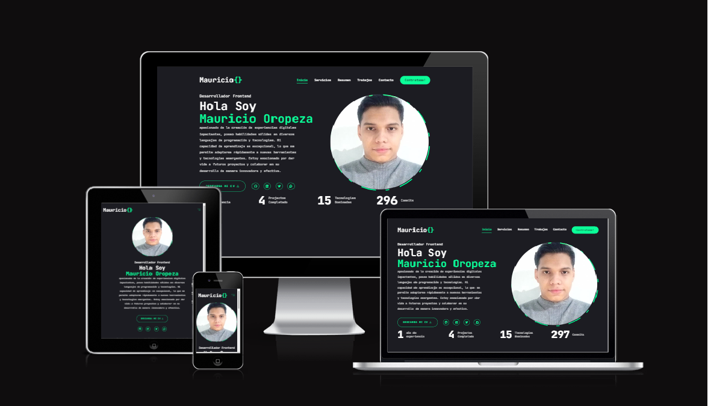

# <div align="center">Mauricio's Porftfolio</div>


## <a href="https://portafolio-tau-bay-37.vercel.app/" target="_blank">Demo en vivo</a>

<p align="center">Mi portafolio que contiene todos mis proyectos y conocimientos hasta ahora</p>

## 💻 Tecnologias

<ul>
  <li><a href="https://reactjs.org/">React</a></li>
  <li><a href="https://nextjs.org/">Nextjs</a></li>
  <li><a href="https://tailwindcss.com/">Tailwindcss</a></li>
  <li><a href="https://www.framer.com/motion/">Framer Motion</a></li>
  <li><a href="https://ui.shadcn.com/">Shadcn ui</a></li>
</ul>

## ⚙️ requerimientos

<ul>
  <li><a href="https://git-scm.com/">Git</a></li>
  <li><a href="https://nodejs.org/en/">Node.js</a></li>
  <li><a href="https://www.npmjs.com/">NPM</a></li>
</ul>

## 🚀 Instalaccion

```
$ npm install
$ npm start
```

